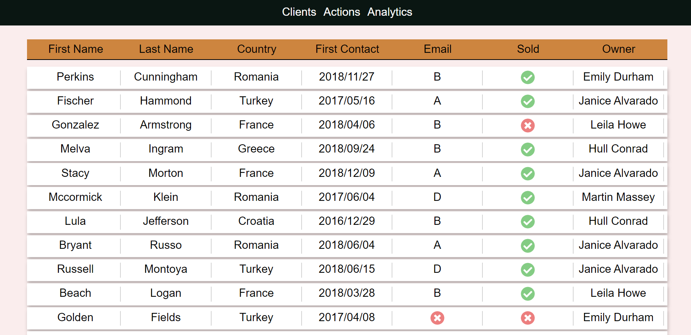
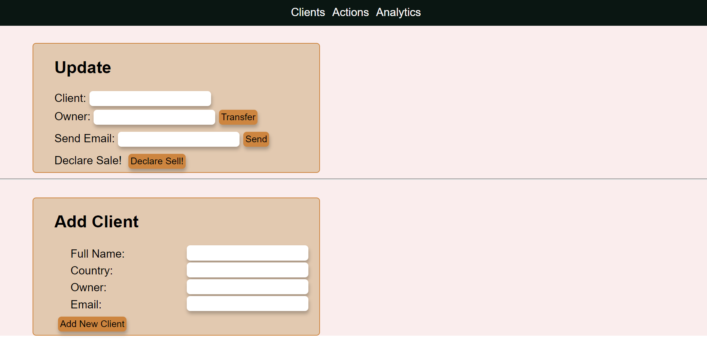
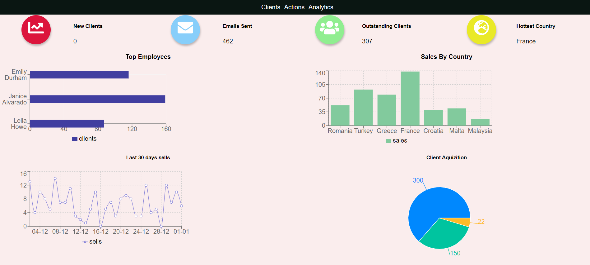

# CRM

CRM is a Client Ralationship Management system built with React. It includes a graphic analytics dashboard for company reports.

## Table Of Contents
- [CRM](#CRM)
  * [Screenshots](#screenshots)
    + [Client List](#client-list)
    + [Add or Update Client](#add-or-update-client)
    + [Analytics Dashboard](#analytics-dashboard)
  * [Tech Stack](#tech-stack)

## Screenshots

### Client List
An overview of all your clients. .

### Add or Update Client
Fill out the inputs and then click *add* or *update* to add a new client. When adding/updating a snackbar will popup to confirm success.

### Analytics Dashboard
View a report of all the metrics regarding your clients.

## Techstack
1. React, Recharts,  and Axios.
2. Express (Node.js), SQL , sequelize.